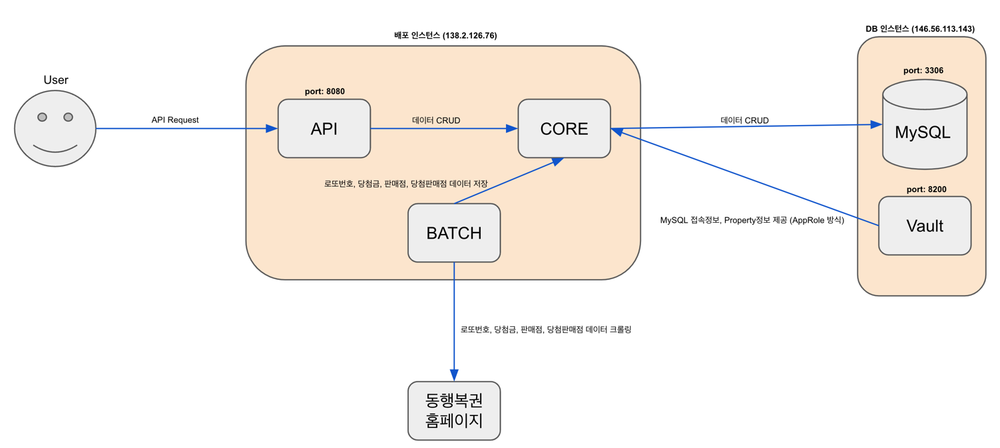

# 로또폴리오
로또판매점 지도 및 로또 포트폴리오 제공 서비스

---

## Contents

 * [담당자](#담당자)
 * [배경](#배경)
 * [개발환경](#개발환경)
 * [프로세스](#프로세스)

---

### 담당자

 * 박윤호

### 배경

 * 지도앱을 통해 로또판매점을 검색하여 찾아갔는데 실제로 로또를 판매하지 않는 곳이 많았음
 * 로또공식홈페이지에서 내려받은 데이터를 지도앱에 표시해주면 좋겠다는 생각에서 출발함
 * 로또 포트폴리오는 사용자가 로또번호 선택시 좀더 도움을 주고자 추가한 기능

### 개발환경

> Project
 * Spring Boot 3.1
 * Kotlin 1.8
 * Gradle 7.6.1
> Architecture
 * Multi Module (api / batch / code)
 * Hexagonal Architecture
> Network
 * Webflux Functional Endpoint
 * Spring Cloud OpenFeign
 * WebClient (Spring Webflux)
> Cache
 * Caffeine Cache
> DB
 * MySQL 8.0.33
 * JPA
 * QueryDSL
 * Spring Cloud Vault
> TestCase
 * Kotest
 * Cucumber
 * WebTestClient
> CICD
 * GitAction
 * DockerHub
 * JIB
 * Oracle Cloud
> Docs
 * SpringDocs Openapi(Swagger)

### 프로세스

